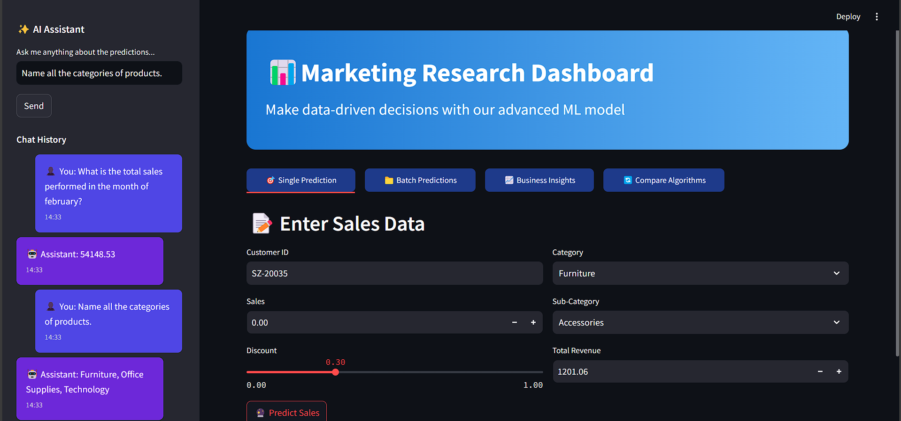

# ML-Product-Prediction
This project is a Machine Learning-based prediction system designed to analyze and forecast key insights using LangChain, Google Gemini AI, and Streamlit. The application leverages LLMs (Large Language Models) for intelligent predictions and interactive user experiences.
🔹 Features
✅ Conversational AI – Uses LangChain with memory for context-aware interactions
✅ Google Gemini AI Integration – Implements state-of-the-art AI models for accurate predictions
✅ Streamlit UI – Provides an intuitive and interactive web interface
✅ Automated Predictions – Enhances decision-making with ML-driven insights

🛠️ Tech Stack
Python (ML & Backend)
LangChain (LLM Framework)
Google Generative AI (Model API)
Streamlit (Web UI)
🚀 Setup Instructions
1️⃣ Clone the Repository

git clone https://github.com/PrasadYewale/ML-Product-Prediction.git

2️⃣ Install Dependencies

pip install -r requirements.txt

3️⃣ Run the Application

streamlit run UI_Final.py

**OUTPUT** 

